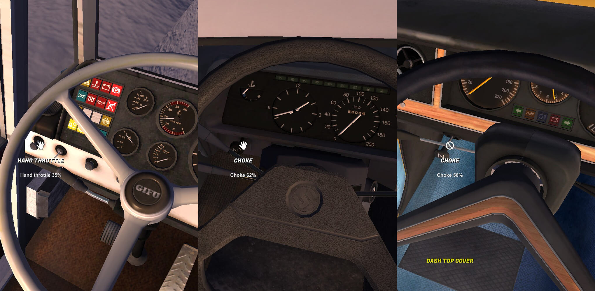
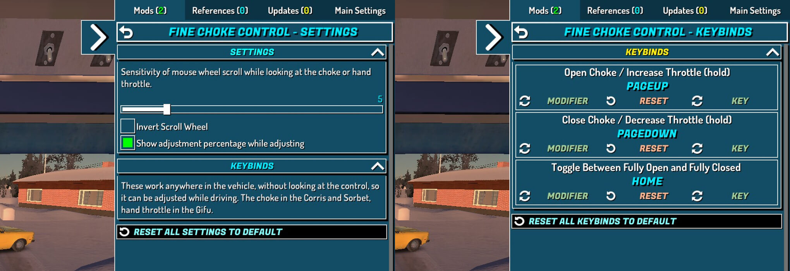

# MWC :: Fine Choke and Hand Throttle Control

This mod adds fine control over the Corris and Sorbet choke, and the Gifu hand throttle, via the scroll wheel.

Use the scroll wheel button to fully close / open in a click. Or set keybinds to control them without hovering over them.

## Controls

| Vehicle | Control |
| --- | --- |
| Corris | Choke |
| Sorbet | Choke, including the dashboard warning light |
| Gifu | Hand throttle |

## Keybinds

Bindable keys work anywhere in the vehicle, without needing to look at the control:

| Action | Default | Behaviour |
| --- | --- | --- |
| Open Choke / Increase Throttle | `Page Up` | Hold to open gradually |
| Close Choke / Decrease Throttle | `Page Down` | Hold to close gradually |
| Toggle | `Home` | Fully open / fully closed |

Rebind them in the MSCLoader keybind panel. The step size setting applies to held keys as well as the scroll wheel.

## Settings

Update sensitivity, invert scrolling and toggle the adjustment percentage via the MSCLoader settings panel.

